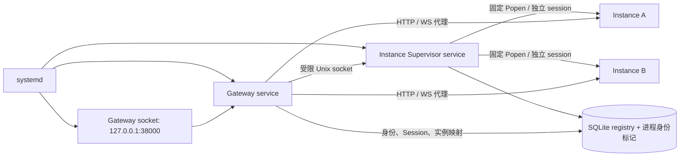

# Gateway 与用户实例独立生命周期

2026-09-13。容量修复基线 `10c8feb9f1926d3f735bf5f307c9a24858697940`。

## 容量上线事实

该提交的运行代码只修改名额及账户启停事务；socket 实验只在文档中，没有未验收的
socket/启动器代码。因此按授权直接快进 beta，无需另造 capacity commit。
本次重新完整回归 578/578，已有开发分支 CI success 后上线同一 SHA。

维护流程：关闭注册并重启 Gateway → 确认关闭 → SQLite online backup/integrity_check →
快进已预取代码并重启 → health 通过 → 恢复 open 并重启。配置不支持热加载，所以共三次。
203 次真实 HTTPS 探测：200=25、预期匿名 401=8、502=170。
50 ms 探测间隔下，三个健康不可用区间上界为 1721.0 / 1685.7 / 1716.8 ms。
这些是维护中断，不是零停机。备份位于 VPS 私有 backups/capacity-maintenance-* 目录，
含在线 SQLite 快照、环境配置、原 systemd/Caddy 配置和安全摘要。
上线后 active seats=1、disabled=2、total=3、remaining=19、MAX_PUBLIC_USERS=20。
两个 disabled 根的完整文件元数据清单前后一致；没有读取或复制生产 Provider 凭证。

## 原因与生命周期图

旧路径：Gateway 的 `Supervisor.start()` 用固定 Popen 启动 worker；Gateway lifespan
退出调用 close() 逐个停止 children，systemd control-group 还会清理同组进程。
worker 的 AuthStore.start_server() 清空实例 Session，因而 Gateway 重启会间接使用户退出。
Gateway Session、SSO nonce 和端口/PID 已持久化；children/Popen 与 WebSocket 桥接任务在进程内。

Gateway 不再是 worker 的父进程。Gateway SIGTERM/崩溃不调用 stop-all、不释放端口，
不撤销实例 Session。CLI 的 stop/enable/disable 同样经 IPC 交给唯一 Supervisor。
直接构造空 socket 的 BetaConfig 仅保留给旧单元测试；真实 from_env 入口禁止空 socket，
IPC 失败绝不回退到 Gateway 自行 spawn。

## IPC 与唯一 authority

`/run/mio-canvas/supervisor.sock`：私有 0700 父目录、0600 socket，属实际 mio-canvas 用户。
Linux 验证 SO_PEERCRED，同 UID 或 root 方可连接；没有 TCP 管理端口。
最多 8 个处理线程，请求体 4096 bytes，读超时 5 秒，控制调用不自动重试。

操作字段采用精确白名单：start(instance_id)、stop(instance_id)、status(instance_id)、list_running()；
另有注册必需的 provision(username, scrypt_hash) 与 account_status(instance_id, enabled)。
后两项保证端口预留、初始化、账户启停仍由同一 authority 串行处理，避免 Gateway 抢占端口。
provision 不传密码明文，hash 不写日志；所有操作都不接收 argv/command/cwd/env。
用户 ID、目录、端口和实际命令均来自受控 registry，不接受浏览器选取。

daemon 生命周期独占 `supervisor-authority.lock`；注册/start/stop/enable/disable/reconcile
共用现有跨进程 flock。MAX_RUNNING_INSTANCES 由 daemon 的实际 PID/启动时间检查控制，
默认仍为 4。Gateway 没有进程 map、运行数或分配端口逻辑。

## 接管、停止与异常

daemon 使用 KillMode=process，目的明确为保留已登记 worker；不是不受控残留进程。
启动先清理可证明属于中断注册的预留，再验证每个 live PID 的 OS 启动时间、系统 UID、
数据根、process.json 中 instance_id/host/port/PID，以及带随机挑战的实例 HMAC 健康证明。
验证后才绑定 socket，ExecStartPost ready 再次确认可处理控制和路由状态。
Gateway lifespan 通过该接口完成 ready，之后才由 Uvicorn 接受请求。

记录 running 但进程消失：标记 stopped，保留端口分配；下一次正常进入启动工作区。
PID/身份/端口/registry 不一致或存在未登记根：安全失败，记录固定事件
supervisor_reconcile_required，不猜所有者、不杀未知 PID、不自动重新分配。
spawn 与持久化之间若发生崩溃，无法证明归属的 live 端口会被隔离，需管理员核对。
daemon 每 5 秒核对状态并回收已退出的子进程句柄。

disable 仍立即撤销中央会话、撤销实例会话并明确 stop，保留全部用户数据。
管理员 stop 同样核对身份，等待进程实际退出后才更新 stopped。
idle stop 可选，PUBLIC_BETA_IDLE_SECONDS=0 保持既有不自动休眠策略；启用后由 daemon 决定，
HTTP/活跃 WebSocket 更新持久化活动时间，Gateway 重启不会丢失 idle 依据。
关闭整个服务群需先逐个管理员 stop；只停止 Supervisor 不代表停止所有用户。
共同 mio-canvas.slice 继续限制合计 MemoryHigh=900M、MemoryMax=1200M、CPUQuota=180%，
不会因拆成两个服务而把原资源预算翻倍。

## WebSocket 与受控重启

Gateway 自己桥接 WS，所以原 TCP 连接会在重启时断开。实例进程、Session、Canvas 保持。
正式首页、文生图、角度页和独立 Smart Canvas 共用 workspace-socket.js：500 ms 起退避，
最高 8 秒；成功后复位，pagehide/明确 1008 权限拒绝停止。只重连传输，不重发生成或写请求。
撤销检测保持原 1 秒间隔。Origin、CSRF、namespace、SSRF 和用户路由规则不变。
本地 WS scheme 校验区分 ws 与 http；生产代理仍要求原 Host/HTTPS/可信代理条件。

Gateway socket 独立持有监听 fd；只在 LISTEN_PID 为本进程且 LISTEN_FDS=1 时传 fd=3 给
已核验的 Uvicorn。Gateway 正常关闭先排空请求，最长 25 秒，systemd 停止预算 45 秒。
不保证 kill -9/OOM/断电时所有网络请求零错误；崩溃测试只验证 worker 和 Session 仍保留。

## 验收记录

- 本地完整 `./scripts/check.sh` 597/597，编译、JS 语法与 diff 检查通过。
- 专项真实 UDS/worker 测试覆盖 A/B PID、Session、Canvas、Provider、Gateway SIGTERM/SIGKILL、
  WS 重连、daemon 重启接管、并发启动、容量、端口、显式 disable/stop、idle、未知进程、IPC 注入。
- 隔离 VPS systemd 实验：独立目录和 loopback 端口，2 个合成账号，无真实 Provider/生成请求。
  受控 Gateway restart 的连续 62 请求全部 200；500/502/503/连接异常均 0；最长等待 1585.3 ms。
  A/B PID 未变，两个实例 Session 均 200，Canvas/Provider 200，B 请求 A Canvas 404。
  daemon 自身正常 restart 后，再 restart Gateway，仍接管相同 PID，Session 有效。
  此为直接 loopback HTTP 实验，不冒充线上 HTTPS 发布压测。
- 最终代码再次通过独立 Caddy 代理连续三轮受控 Gateway restart：124 请求全部 200，
  500/502/503/连接异常均 0，最大请求等待 1761.8 ms。PID、Session 和 daemon 接管均再次通过。
  测试 Caddy 使用 admin off 和独立 loopback 端口，配置先 validate；未修改/重载生产 Caddy。
- 完整浏览器：注册合成账号进入完整 UI，保存画布；Gateway restart 后观测到自动 WS 101，
  未重新登录即可打开个人 API 设置，刷新画布仍存在。实例 PID 未变，logout 回到登录页，
  新匿名 Canvas/Provider 请求 401；mock createTask=0、真实模型调用=0。

可复现实验脚本为 `tests/manual_gateway_lifecycle.py`，在 Linux/systemd 测试机以管理员运行，
明确提供 `--program <已准备的测试源码目录> --data-parent <私有临时数据父目录> --python <兼容解释器>`。
它创建独立临时 units、账号、端口和 Caddy 进程，结束时经 IPC 停测试 worker，并删除临时 units；
保留私有测试目录及 safe-result.json 供核验，不读取任何生产用户内容。

## 首次迁移与后续发布边界

本次生产只上线容量 commit。解耦代码与 units 单独提交，不自动替换生产服务布局。
首次迁移仍需维护窗口：旧 Gateway 的 shutdown/cgroup 语义无法由新进程事后改变。
备份后准备完整不可变 release 目录、依赖、配置和 units，先验证并关闭注册，再停旧 Gateway，
启动独立 daemon/ready，再启动 socket/Gateway，验证实例路由和登录后开放注册。
保留旧代码、配置和 SQLite online backup 作为回退依据，回退不得覆盖更新后的用户数据。

之后版本采用不可变 release 目录：旧 worker 继续读旧 PROGRAM_ROOT，新 daemon 从新 release
启动新 worker；不要原地改写仍运行 worker 的代码/静态资源。旧 release 在相关 worker 停止前保留。
一次 Gateway 更新无需重启用户实例；需要更新用户实例代码时另行安排该实例的安全重启。
不同时运行两个 Gateway，不改 Caddy 其他站点，不改 owner/main/stable/VERSION。
